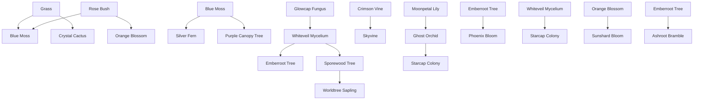

# Unlock dependency graph

This document records the unlock conditions in plant_unlock_conditions.json and preserves the boolean condition tree without flattening AND/OR/NOT logic incorrectly.

## Human-readable dependency table

| Plant | Unlock tree |
| --- | --- |
{chr(10).join(lock_table)}

## Dependency graph

The unlock graph is best represented as a dependency graph over plant names, species presence, animal presence, events and coverage thresholds. The graph is not a simple linear chain because unlocks use AND/OR/NOT and many requirements are count-, coverage-, feature-, and event-gated.

## Earliest prerequisite chains

The unlock data shows that the five initial plants form the root of the unlock graph.

- Initial root species: Grass, Rose Bush, Lavender, Dwarf Sunflower, Oak Tree
- Grass + Rose Bush + Loamcrawlers unlock Blue Moss
- Rose Bush + Nectaris/Solwings unlock Orange Blossom
- Loamcrawlers + dead_matter unlock Glowcap Fungus
- Blue Moss + Crimson Vine + Purple Canopy Tree unlock later major forest species

## Event-gated species

- Crystal Cactus requires Drought
- Mire Bloom requires Rain
- Phoenix Bloom requires Ash Eclipse

## Animal-gated species

- Blue Moss requires Loamcrawlers
- Orange Blossom requires Nectaris or Solwings
- Glowcap Fungus requires Loamcrawlers
- Stone Reed requires Virexids
- Silver Fern requires Loamcrawlers or Grazeleths
- Whiteveil Mycelium requires Loamcrawlers or Rhizorends
- Moonpetal Lily requires Nectaris
- Ironthorn Shrub requires Grazeleths
- Razorgrass requires Verdelopes
- Amber Fern requires Loamcrawlers and species_absent Monocryx
- Bloodbloom requires Rhizorends
- Living Topiary requires Canorals
- Worldtree Sapling requires Barkskips

## Coverage-gated species

Almost every species unlock requires coverage of a preceding plant. Examples include Blue Moss (Grass, Rose Bush), Orange Blossom (Rose Bush), Purple Canopy Tree (Blue Moss, Crimson Vine), Glowcap Fungus (dead_matter feature_count), and many others.

## Count-gated species

- Emberroot Tree requires Purple Canopy Tree count >= 4
- Skyvine requires Purple Canopy Tree count >= 3
- Sporewood Tree requires Purple Canopy Tree count >= 4
- Worldtree Sapling requires Oak Tree >= 6, Purple Canopy Tree >= 6, Sporewood Tree >= 4

## Feature-gated species

- Glowcap Fungus uses feature_count(dead_matter)
- Ashroot Bramble uses feature_count(burnt_soil) >= 20

## Species-absence conditions

- Amber Fern requires species_absent Monocryx

## Priority species analysis

{chr(10).join(priority_snippets)}

## Important note

The unlock logic contains nested AND/OR/NOT trees. These conditions are not flattened in the source data and must not be flattened by any implementation. Several species do not unlock from a single ancestor but from a combination of plant coverage, animal presence, world events, feature counts, and count thresholds.
